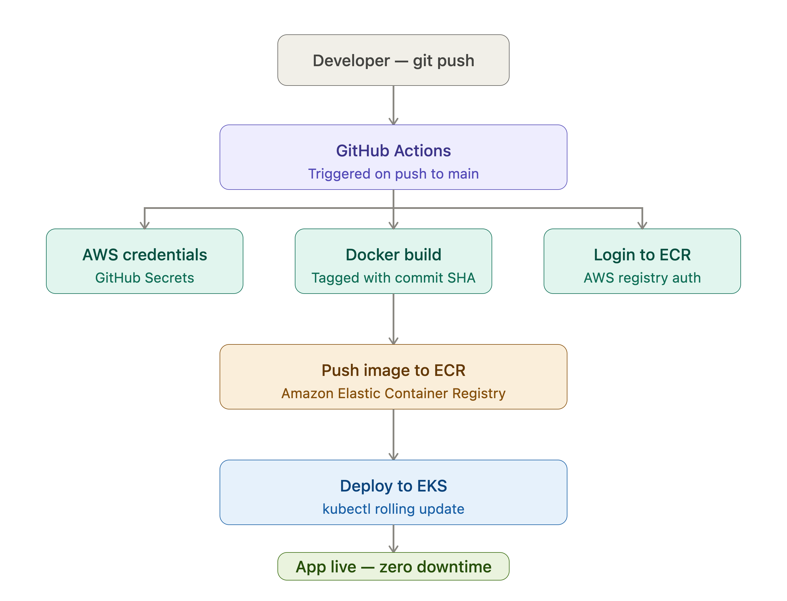
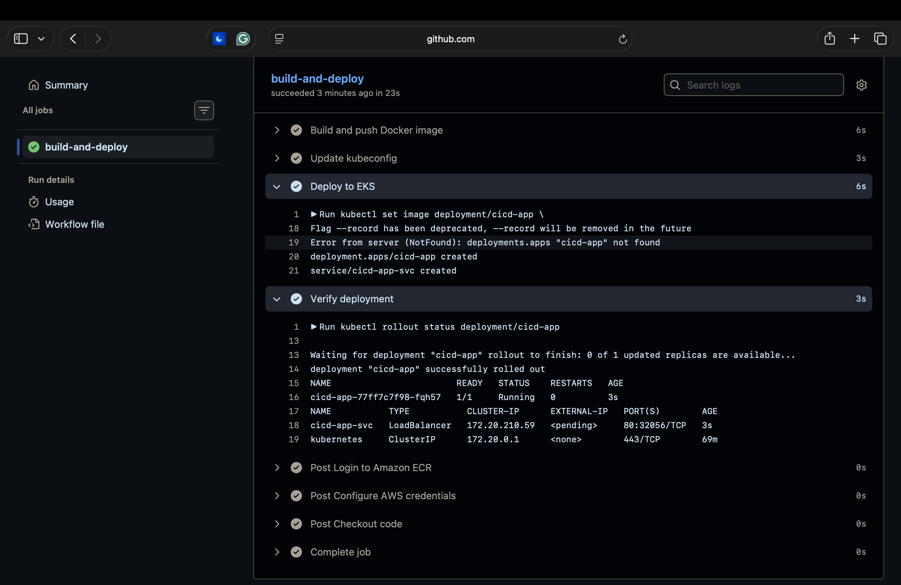
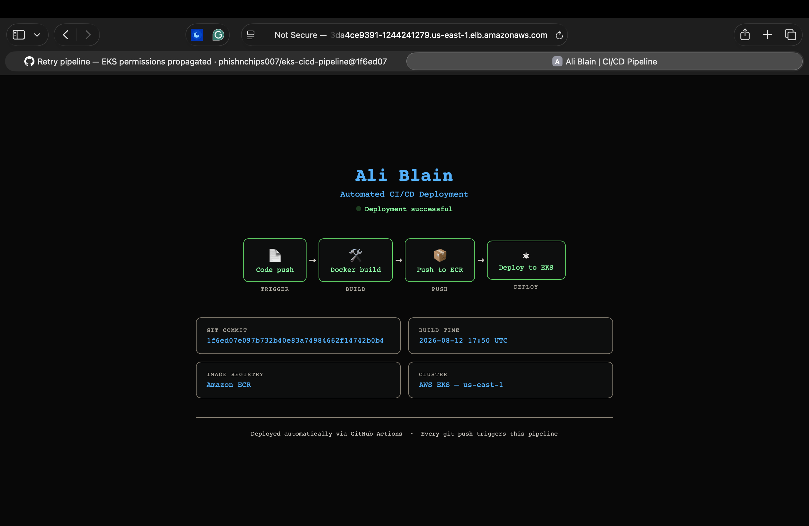
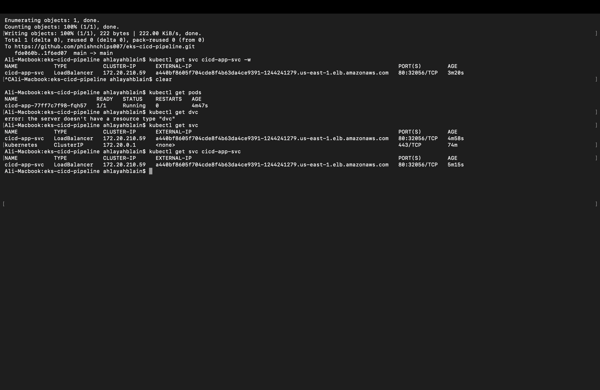

# Automated CI/CD Pipeline — GitHub Actions + EKS

Every git push to main automatically builds a Docker image, pushes it to Amazon ECR, and deploys to AWS EKS with zero downtime.

---

## 🎯 Why I Built This

After provisioning an EKS cluster with Terraform in my previous project, I wanted to eliminate the manual deployment step. In a real engineering team nobody should be running kubectl commands by hand every time code changes — that's slow, error-prone, and doesn't scale.

This pipeline automates the entire path from code commit to running container. Every push triggers a build, every build is tagged with the exact git commit SHA for traceability, and every deployment is a rolling update so users never see downtime.

---

## 🏗️ Architecture

---

## 🛠️ Tech Stack

| Tool | Purpose |
|------|---------|
| GitHub Actions | CI/CD pipeline runner |
| Docker | Container image build |
| Amazon ECR | Private container registry |
| AWS EKS | Managed Kubernetes cluster |
| kubectl | Kubernetes deployment |
| Terraform | Cluster provisioned via IaC |

---

## ⚙️ Pipeline Stages

    git push → GitHub Actions triggered
             → Checkout code
             → Configure AWS credentials
             → Login to ECR
             → sed replaces placeholders with commit SHA + timestamp
             → docker build → image tagged with commit SHA
             → docker push → image stored in ECR
             → aws eks update-kubeconfig
             → kubectl set image → rolling update on EKS
             → kubectl apply -f service.yml → LoadBalancer created
             → kubectl rollout status → verify deployment healthy

---

## 📸 Screenshots

### Pipeline — all steps passing

### Live app — auto-deployed with commit SHA

### Cluster pods and services

---

## 🔐 Secrets Required

Store these in GitHub → Settings → Secrets → Actions:

| Secret | Description |
|--------|-------------|
| AWS_ACCESS_KEY_ID | IAM user access key |
| AWS_SECRET_ACCESS_KEY | IAM user secret key |
| AWS_ACCOUNT_ID | Your AWS account ID |

---

## ▶️ How to Use

Fork this repo, add your AWS secrets, and push any change to main. The pipeline runs automatically.

---

## 🧹 Teardown

    kubectl delete svc cicd-app-svc
    cd ../eks-terraform
    terraform destroy

---

## 💡 Key Concepts Demonstrated

- GitOps — git push is the only deployment trigger
- Image tagging — every image tagged with commit SHA for traceability
- Rolling updates — zero downtime deployments via Kubernetes
- GitHub Secrets — AWS credentials never exposed in code
- Idempotent deployments — kubectl apply safe to run on every push
